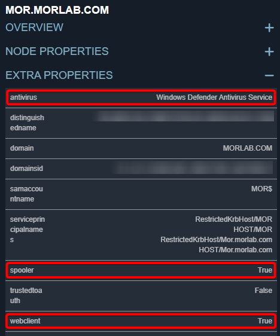

# DavidHound
This software is designed to collect data from Active Directory environments, similar to SharpHound. It provides various command-line options to gather information like:
- WebDAV
- Print Spooler
- IP addresses for every host
- Antivirus \ EDR installed on the machine
- LDAP signing status.

*Coming soon: Sessions, SMB Signing, Kerberoast, ASREPRoast, Pre2K, SCCM.*

The tool uses multi-threading for efficient data collection across domains, making it useful for security assessments and AD environment auditing.

After collecting the data, the output file can be loaded into BloodHound/Neo4j using [MDLoader.py](https://github.com/MorDavid/MDLoader)



## Usage
```
  █▀▄ █▀█ █ █ ▀█▀ █▀▄   █ █ █▀█ █ █ █▀█ █▀▄
  █ █ █▀█ ▀▄▀  █  █ █   █▀█ █ █ █ █ █ █ █ █
  ▀▀  ▀ ▀  ▀  ▀▀▀ ▀▀    ▀ ▀ ▀▀▀ ▀▀▀ ▀ ▀ ▀▀
                               By Mor David

Usage: [options]
Options:
  -h, --help              Show this help message and exit.
  -d, --domain [name]     Specify the domain name.
  -f, --file [file]       Specify the input file name.
  -o, --output [file]     Specify the output file name.
  -t, --threads [number]  Set the number of threads.
  -wd, --webdav           Enable WebDAV check.
  -sp, --spooler          Enable Print Spooler check.
  -ip, --ips              Enable IP address check.
  -av, --antivirus        Enable antivirus check.
  -ls, --ldapsigning      Enable LDAP signing check.
```

## Disclaimer
- Some of the code in this program is derived from PingCastle.